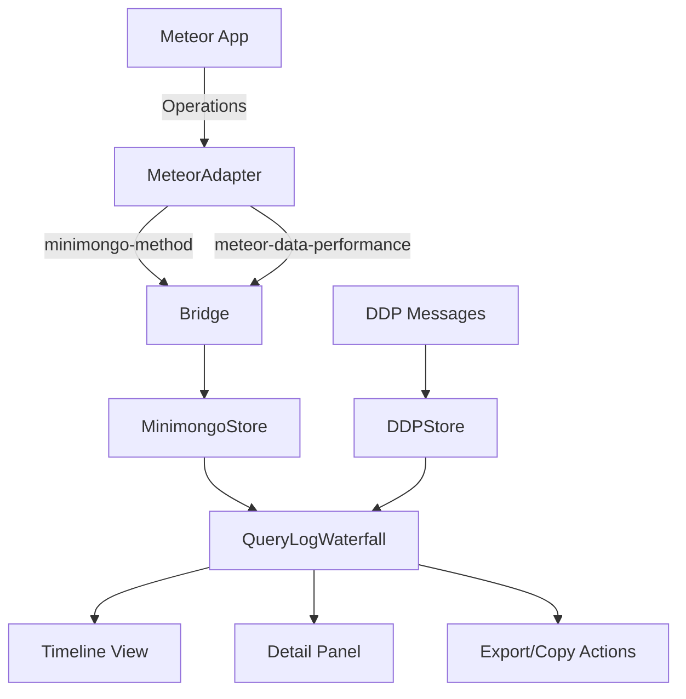

# Query Log Design Document

## Overview
The Query Log provides a comprehensive view of all Minimongo operations, their performance characteristics, and their relationship to DDP messages. It presents this data in a waterfall timeline format similar to Chrome DevTools Network panel, making it easy to identify performance bottlenecks and understand data flow.

## Current Architecture

### Existing Components We Can Leverage

1. **MeteorAdapter** (`src/Injectors/MeteorAdapter.ts`)
   - Already intercepts all Minimongo operations
   - Captures timing, selectors, and collection names
   - Sends both `minimongo-method` and `meteor-data-performance` messages

2. **MinimongoStore** (`src/Stores/Panel/MinimongoStore/index.ts`)
   - Maintains `methodLogs` array with all operations
   - Has correlation capabilities with DDP messages

3. **DDPStore** (`src/Stores/Panel/DDPStore.ts`)
   - Contains all DDP messages with timestamps
   - Has filtering and search capabilities
   - Provides correlation IDs

4. **UI Components**
   - `QueryLogList` - Current basic table view
   - `ObjectTreerinator` - JSON viewer component
   - `DrawerJSON` - Expandable detail drawer
   - `StatusBar` - Bottom status with actions

## Proposed Architecture

### Core Components

#### 1. QueryLogWaterfall Component
```typescript
interface QueryLogWaterfallProps {
  logs: MinimongoMethodLog[]
  ddpMessages: DDPLog[]
  timeRange: [number, number]
  zoom: number
}
```

**Features:**
- Timeline axis with millisecond precision
- Horizontal bars showing operation duration
- Vertical lines connecting DDP messages to queries
- Color coding by operation type
- Hover tooltips with quick info
- Click to select and show details

#### 2. QueryLogDetail Component
```typescript
interface QueryLogDetailProps {
  log: MinimongoMethodLog
  ddpMessage?: DDPLog
  results?: any[]
}
```

**Features:**
- Expandable sections for:
  - Query parameters (selector, options)
  - Results preview (first 5-10 documents)
  - Stack trace with file:line links
  - Related DDP message
- Action buttons:
  - Copy as Meteor.call()
  - Copy as fetch()
  - Copy selector
  - View in Minimongo tab
  - Jump to DDP message

#### 3. QueryLogToolbar Component
```typescript
interface QueryLogToolbarProps {
  onFilter: (filters: QueryFilters) => void
  onTimeRangeChange: (range: [number, number]) => void
  onExport: () => void
}
```

**Features:**
- Collection filter dropdown
- Method filter (find, insert, update, etc.)
- Time range selector
- Performance filter (>10ms, >100ms)
- Search by selector content
- Export as HAR/JSON

### Data Flow



### Visual Design

#### Timeline Layout
```
Time  0ms    100ms   200ms   300ms   400ms   500ms
│─────┼───────┼───────┼───────┼───────┼───────┤
│
├─[DDP: sub/users]──────────────┐
│                               ▼
│                    ████ users.find() 45ms
│                    ├─░░ users.fetch() 12ms
│                    └─░░ users.forEach() 3ms
│
├─[DDP: method/updateProfile]───┐
│                               ▼
│                    ██ users.update() 23ms
│
└─────────────────────────────────────────────
```

#### Color Scheme (Following Existing Patterns)
- **Find/Fetch**: Blue (#3182ce)
- **Insert**: Green (#10b981)
- **Update**: Orange (#f59e0b)
- **Remove**: Red (#ef4444)
- **DDP Link**: Purple (#8b5cf6)

### Implementation Plan

#### Phase 1: Enhanced Data Collection
- [x] Capture operation timing (already done)
- [ ] Add high-precision timestamps (performance.now())
- [ ] Capture result counts
- [ ] Link to originating DDP messages

#### Phase 2: Waterfall Visualization
- [ ] Create timeline axis component
- [ ] Implement operation bars with duration
- [ ] Add DDP correlation lines
- [ ] Implement zoom/pan controls

#### Phase 3: Interactive Features
- [ ] Click to select operation
- [ ] Expandable detail panel
- [ ] Copy command generation
- [ ] Stack trace with source links

#### Phase 4: Advanced Features
- [ ] Performance analysis (slow query highlighting)
- [ ] Pattern detection (N+1 queries)
- [ ] Export capabilities
- [ ] Replay functionality

## Integration Points

### With DDP Tab
- Click DDP correlation tag → Jump to DDP message
- Show DDP message that triggered the query
- Timeline alignment between tabs

### With Minimongo Tab
- Click "View Collection" → Jump to collection in Minimongo
- Show current collection state at query time
- Preview query results inline

### With Performance Tab
- Aggregate stats feed into Performance tab
- Slow query alerts
- Method-level performance tracking

## Code Examples

### Waterfall Item Rendering
```tsx
const WaterfallItem = ({ log, startTime, scale }) => {
  const relativeStart = (log.timestamp - startTime) * scale
  const width = log.runtime * scale

  return (
    <div
      className="waterfall-item"
      style={{
        left: `${relativeStart}px`,
        width: `${width}px`,
        backgroundColor: getColorForMethod(log.method)
      }}
      onClick={() => selectLog(log)}
    >
      <span>{log.collectionName}.{log.method}</span>
      <span className="duration">{log.runtime}ms</span>
    </div>
  )
}
```

### Copy Command Generation

#### Basic Query Copy
```typescript
const generateMeteorCall = (log: MinimongoMethodLog) => {
  const { collectionName, method, selector, modifier } = log

  switch(method) {
    case 'find':
    case 'findOne':
      return `${collectionName}.${method}(${JSON.stringify(selector)})`
    case 'insert':
      return `${collectionName}.insert(${JSON.stringify(selector)})`
    case 'update':
      return `${collectionName}.update(${JSON.stringify(selector)}, ${JSON.stringify(modifier)})`
    default:
      return `${collectionName}.${method}(...)`
  }
}
```

#### Standalone Script Generation
```typescript
interface ScriptOptions {
  includeDDPClient: boolean      // Include DDP connection code
  includeLoginBoilerplate: boolean // Include login with stored token
  includeDisplayCode: boolean    // Include code to display results
  collectionName: string
  selector: any
  options?: any
}

const generateStandaloneScript = (log: MinimongoMethodLog, options: ScriptOptions) => {
  const parts = []

  // 1. DDP Client Setup (optional)
  if (options.includeDDPClient) {
    parts.push(`// DDP Client Setup
import DDP from 'ddp.js';

const ddp = new DDP({
  endpoint: window.location.origin + '/sockjs',
  SocketConstructor: WebSocket
});

ddp.on('connected', () => {
  console.log('Connected to Meteor server');
});
`)
  }

  // 2. Login Boilerplate (optional, unchecked by default)
  if (options.includeLoginBoilerplate) {
    parts.push(`// Login with stored token
const loginWithToken = async () => {
  const token = localStorage.getItem('Meteor.loginToken');
  const userId = localStorage.getItem('Meteor.userId');

  if (!token || !userId) {
    console.error('No stored login token found. Please login first.');
    return false;
  }

  return new Promise((resolve, reject) => {
    Meteor.loginWithToken(token, (error) => {
      if (error) {
        console.error('Login failed:', error);
        reject(error);
      } else {
        console.log('Logged in as user:', userId);
        resolve(true);
      }
    });
  });
};

// Wait for login before querying
await loginWithToken();
`)
  }

  // 3. Collection Setup
  parts.push(`// Collection Setup
const ${log.collectionName} = new Mongo.Collection('${log.collectionName}');

// Subscribe to data (adjust subscription name as needed)
const sub = Meteor.subscribe('${log.collectionName}.all', {
  onReady: () => console.log('Subscription ready'),
  onStop: (error) => error && console.error('Subscription stopped:', error)
});
`)

  // 4. The Actual Query
  parts.push(`// Execute Query
const selector = ${JSON.stringify(log.selector, null, 2)};
const options = ${JSON.stringify(log.options || {}, null, 2)};

const results = ${log.collectionName}.${log.method}(selector, options)${
  log.method === 'find' ? '.fetch()' : ''
};

console.log('Query Results:', results);
`)

  // 5. Display on Page (optional)
  if (options.includeDisplayCode) {
    parts.push(`// Display Results on Page
const displayResults = (data) => {
  // Remove existing display if any
  const existingDisplay = document.getElementById('meteor-query-results');
  if (existingDisplay) {
    existingDisplay.remove();
  }

  // Create display element
  const display = document.createElement('div');
  display.id = 'meteor-query-results';
  display.style.cssText = \`
    position: fixed;
    top: 10px;
    right: 10px;
    max-width: 400px;
    max-height: 80vh;
    overflow: auto;
    background: white;
    border: 2px solid #4299e1;
    border-radius: 8px;
    padding: 16px;
    box-shadow: 0 4px 6px rgba(0, 0, 0, 0.1);
    z-index: 9999;
    font-family: monospace;
    font-size: 12px;
  \`;

  // Add content
  display.innerHTML = \`
    <div style="display: flex; justify-content: space-between; margin-bottom: 12px;">
      <h3 style="margin: 0; color: #2b6cb5;">Query Results</h3>
      <button onclick="this.parentElement.parentElement.remove()"
              style="background: #ef4444; color: white; border: none;
                     border-radius: 4px; padding: 4px 8px; cursor: pointer;">
        ×
      </button>
    </div>
    <div style="margin-bottom: 8px; color: #666;">
      <strong>Collection:</strong> ${log.collectionName}<br>
      <strong>Method:</strong> ${log.method}<br>
      <strong>Count:</strong> \${Array.isArray(data) ? data.length : 1}<br>
      <strong>Time:</strong> \${new Date().toLocaleTimeString()}
    </div>
    <pre style="background: #f3f4f6; padding: 8px; border-radius: 4px;
                overflow: auto; max-height: 400px;">\${JSON.stringify(data, null, 2)}</pre>
  \`;

  document.body.appendChild(display);
};

// Display the results
displayResults(results);

// Auto-refresh every 2 seconds (optional)
const autoRefresh = setInterval(() => {
  const freshResults = ${log.collectionName}.${log.method}(selector, options)${
    log.method === 'find' ? '.fetch()' : ''
  };
  displayResults(freshResults);
}, 2000);

// Stop auto-refresh after 30 seconds
setTimeout(() => clearInterval(autoRefresh), 30000);
`)
  }

  // 6. Cleanup
  parts.push(`// Cleanup (run when done)
// sub.stop();  // Stop subscription
// ddp.disconnect();  // Disconnect DDP client
`)

  return parts.join('\n')
}
```

#### Console-Ready Script (One-Liner)
```typescript
const generateConsoleScript = (log: MinimongoMethodLog, includeDisplay = true) => {
  const query = `${log.collectionName}.${log.method}(${
    JSON.stringify(log.selector)
  }${log.options ? ', ' + JSON.stringify(log.options) : ''})${
    log.method === 'find' ? '.fetch()' : ''
  }`

  if (!includeDisplay) {
    return query
  }

  // One-liner that queries and displays in one go
  return `(() => {
  const r = ${query};
  const d = document.createElement('div');
  d.style.cssText = 'position:fixed;top:10px;right:10px;max-width:400px;background:white;border:2px solid #4299e1;padding:16px;border-radius:8px;box-shadow:0 4px 6px rgba(0,0,0,0.1);z-index:9999;';
  d.innerHTML = '<h3>Results (${log.collectionName}.${log.method})</h3><pre style="max-height:400px;overflow:auto">' + JSON.stringify(r, null, 2) + '</pre><button onclick="this.parentElement.remove()" style="position:absolute;top:10px;right:10px">×</button>';
  document.body.appendChild(d);
  return r;
})()`
}
```

### UI Component for Script Options
```tsx
const QueryCopyPanel = ({ log }) => {
  const [options, setOptions] = useState({
    includeDDPClient: false,
    includeLoginBoilerplate: false,  // Unchecked by default
    includeDisplayCode: true,
    format: 'console' // 'console' | 'script' | 'module'
  })

  const handleCopy = () => {
    let code = ''

    if (options.format === 'console') {
      code = generateConsoleScript(log, options.includeDisplayCode)
    } else {
      code = generateStandaloneScript(log, options)
    }

    navigator.clipboard.writeText(code)
    toast.success('Copied to clipboard!')
  }

  return (
    <div className="query-copy-panel">
      <h4>Copy Query As:</h4>

      <div className="format-selector">
        <label>
          <input
            type="radio"
            value="console"
            checked={options.format === 'console'}
            onChange={(e) => setOptions({...options, format: e.target.value})}
          />
          Console (One-liner)
        </label>
        <label>
          <input
            type="radio"
            value="script"
            checked={options.format === 'script'}
            onChange={(e) => setOptions({...options, format: e.target.value})}
          />
          Standalone Script
        </label>
      </div>

      {options.format === 'script' && (
        <div className="script-options">
          <label>
            <input
              type="checkbox"
              checked={options.includeDDPClient}
              onChange={(e) => setOptions({...options, includeDDPClient: e.target.checked})}
            />
            Include DDP Client Setup
          </label>

          <label>
            <input
              type="checkbox"
              checked={options.includeLoginBoilerplate}
              onChange={(e) => setOptions({...options, includeLoginBoilerplate: e.target.checked})}
            />
            Include Login with Token (for authenticated queries)
          </label>

          <label>
            <input
              type="checkbox"
              checked={options.includeDisplayCode}
              onChange={(e) => setOptions({...options, includeDisplayCode: e.target.checked})}
            />
            Display Results on Page
          </label>
        </div>
      )}

      <div className="preview">
        <h5>Preview:</h5>
        <pre className="code-preview">
          {options.format === 'console'
            ? generateConsoleScript(log, options.includeDisplayCode)
            : generateStandaloneScript(log, options)
          }
        </pre>
      </div>

      <button onClick={handleCopy} className="copy-button">
        📋 Copy to Clipboard
      </button>
    </div>
  )
}
```

### Performance Analysis
```typescript
const analyzeQueryPattern = (logs: MinimongoMethodLog[]) => {
  // Detect N+1 queries
  const patterns = logs.reduce((acc, log, i) => {
    const similar = logs.slice(i+1, i+10).filter(l =>
      l.collectionName === log.collectionName &&
      l.method === log.method &&
      JSON.stringify(l.selector).includes('_id')
    )

    if (similar.length > 3) {
      acc.push({
        type: 'N+1',
        collection: log.collectionName,
        count: similar.length,
        suggestion: 'Consider using $in selector'
      })
    }

    return acc
  }, [])

  return patterns
}
```

## Success Metrics

1. **Performance Visibility**: Users can identify slow queries at a glance
2. **DDP Correlation**: Clear connection between network and database operations
3. **Developer Productivity**: Quick access to copy/replay commands
4. **Pattern Recognition**: Automatic detection of common issues (N+1)
5. **Native Feel**: Consistent with Chrome DevTools patterns and MDE design

## References

- Chrome DevTools Network Panel (waterfall inspiration)
- React DevTools Profiler (timeline visualization)
- MongoDB Compass (query analysis)
- Existing MDE components (consistency)